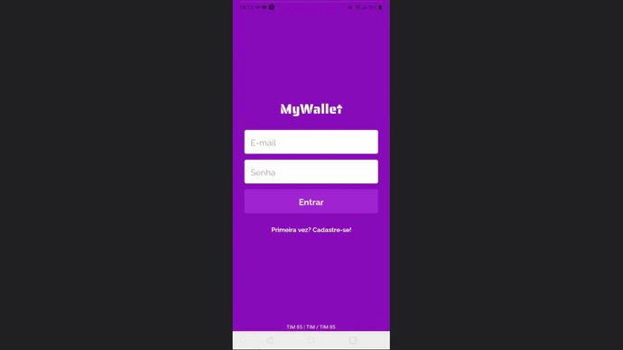

# MyWallet

MyWallet é um aplicativo mobile para android para gestão das finanças do usuário. Nele é possível registrar suas despesas e receitas, de modo a ter um balanço da sua atual situação financeira, deixando tudo mais organizado.



## Sobre

Principais funcionalidades implementadas:

- Registro (Sign up)
- Login
- Home, com a lista de todos os registros feitos pelo usuário, bem como o balanço financeiro atual
- Registrar nova receita
- Registrar nova despesa
- Atualizar descrição ou quantia de um registro
- Deletar registro

## Tecnologias

Algumas das principais tecnologias e frameworks utilizados no projeto.<br/><br/>
Front-end:<br/>

<div>
    
    
    
    
    
    
</div>

<br/>API:<br/>

<div>
    
    
    
    
</div>

## Como rodar o projeto

1. Clone o repositório
2. Instale as dependências

```bash
npm i
```

3. Execute o projeto

```bash
npm start
```

4. Siga as instruções fornecidas pela interface Expo (escanear o QR code mostrado) 
